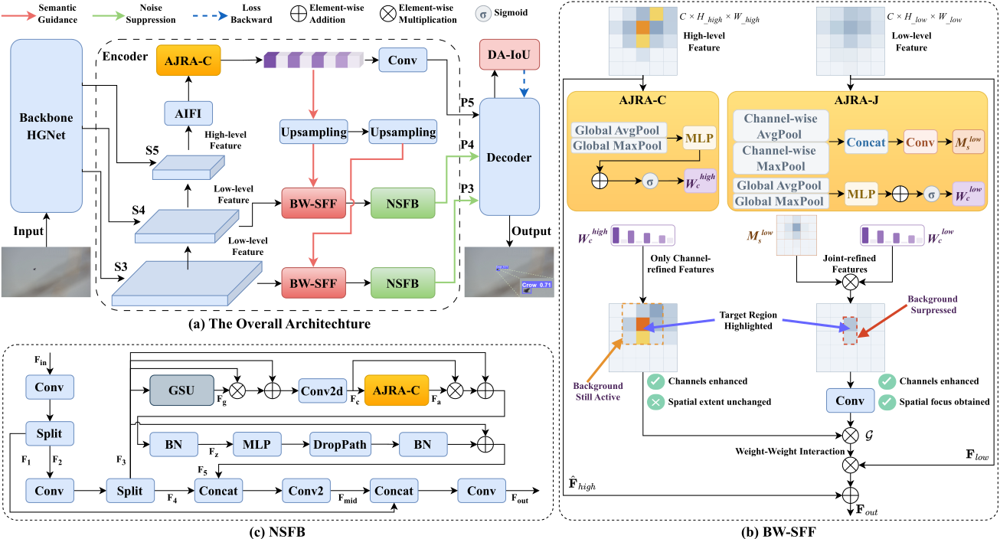
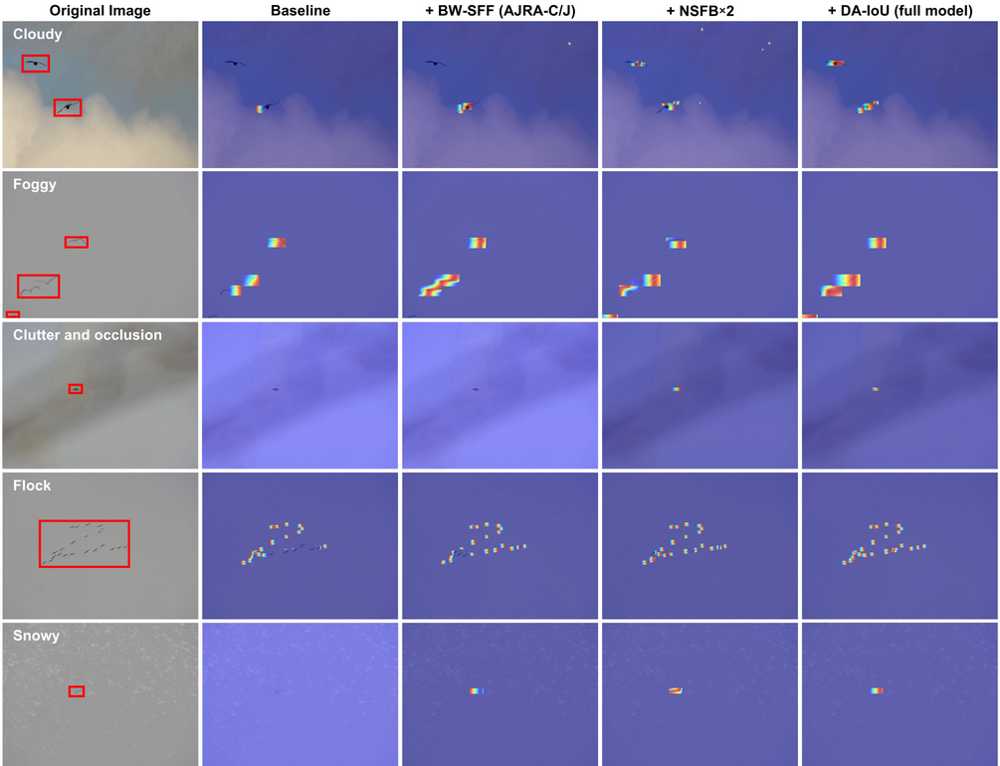
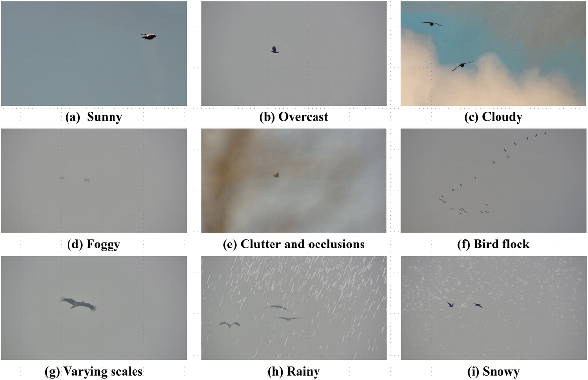

# ARISNet: Asymmetric Ratio and Interactive Selection Network for Airport Bird Strike Prevention
**Authors:** Dongjie Zhou, Chang Liu, Hongtao Chen, Wenrui Li, Member, IEEE Wangmeng Zuo, Senior Member, IEEE Xiaopeng Fan, Senior Member, IEEE

---

- [2026/06] ARISNet training and inference code has been released.
- [2026/06] A preliminary version of the AFBirds dataset has been released.

---

## Overview
This repository provides the official implementation of **ARISNet**, an asymmetric ratio and interactive selection network for airport bird strike prevention. Built upon RT-DETR, ARISNet integrates stage-specific attention decoupling (via **AJRA** with AJRA-C/AJRA-J variants), hierarchical cross-dimensional gating (via **BW-SFF**), physics-inspired noise suppression (via **NSFB**), and ordered center-prioritized regression (via **DA-IoU** loss) to mitigate feature miscalibration, cross-scale semantic-spatial misalignment, environmental noise contamination for small targets, and optimization instability for fast-moving birds.
<p align="center">
  
</p>

**Figure**: ARISNet: Overall Architecture and Detailed Views of the AJRA, BW-SFF and NSFB Modules.

<p align="center">
  
</p>

**Figure**: Heatmap visualizations of each module's contribution.

---

## Environment Setup
```bash
# 1. Clone the repository
git clone https://github.com/tiger413/ARISNet.git
cd ARISNet

# 2. Create a virtual environment
conda create -n arisnet python=3.9

# 3. Activate the virtual environment
conda activate arisnet

# 4. Install dependencies
pip install -r requirements.txt

# 5. Install the project in editable/development mode
pip install -e .
```

---

## AFBirds Dataset

### Introduction

The Airport Fine-Grained Birds Dataset (AFBirds), comprising 6,015 images (1920 × 1080) of 8 common airport bird species, including crow, egret, gull, goose, crane, heron, stork and duck. All images are captured from ground-to-air perspectives.

<p align="center">
  
</p> 

**Figure**: Diverse scenarios in the AFBirds Dataset.

### Download
Download AFBirds dataset from Baidu Netdisk and place it in the repository root directory:

- Baidu Netdisk: 

---

## Training

Run training:

```bash
python src/train.py
```
---

## Inference (Testing)

Run inference:

```bash
python src/test.py
```

------

## Acknowledgements

This project builds upon and is inspired by the following open-source projects and resources:

- Baidu: https://github.com/lyuwenyu/RT-DETR
- Ultralytics: https://github.com/ultralytics/ultralytics

We thank the authors for their excellent work.

------

## Contact

If you have any questions, please contact dongjiezhou@stu.hit.edu.cn
